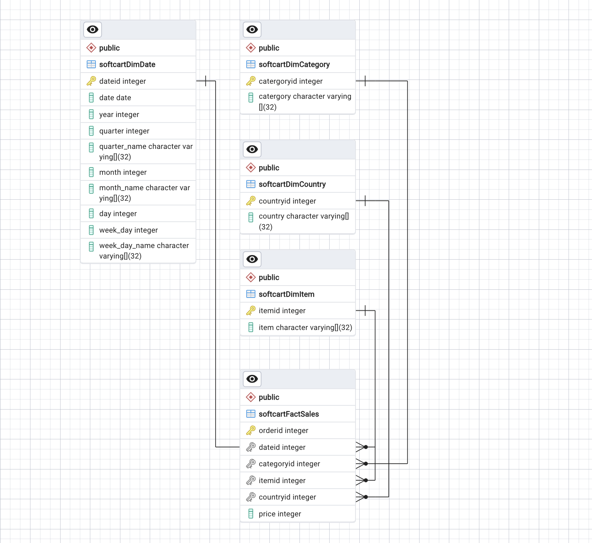

#  Data Warehouse Design

>  The company retails download only items like E-Books, Movies, Songs etc. The company has international presence and customers from all over the world. The company would like to create a data warehouse so that it can create reports like
>- total sales per year per country
>- total sales per month per category
>- total sales per quarter per country
>- total sales per category per country

## Objectives

In this assignment you will:

- Design a Data Warehouse using the pgAdmin ERD design tool.
- Create the schema in the Data Warehouse


## 1. Data Warehouse Schema


Based on the sample data and report requirements, the fact and dimension tables will be constructed in the following:

- `softcartDimDate`
     
    - `dateid`<sup><sub>PRIMARY KEY</sub></sup>
    - `date`
    - `year`
    - `quarter`
    - `quarter_name`
    - `month`
    - `month_name`
    - `day`
    - `week_day`
    - `week_day_name`

- `softcartDimCategory`

    -  `categoryid`<sup><sub>PRIMARY KEY</sub></sup>
    -   `category`
    
- `softcartDimItem`

    - `itemid`<sup><sub>PRIMARY KEY</sub></sup>
    - `item`

- `softcartDimCountry`

    - `countryid`<sup><sub>PRIMARY KEY</sub></sup>
    - `country`

- Finally we will create the `softcartFactSales`

- `softcartFactSales`

    - `orderid`<sup><sub>PRIMARY KEY</sub></sup>
    - `dateid`<sup><sub>FOREIGN KEY</sub></sup>
    - `categoryid`<sup><sub>FOREIGN KEY</sub></sup>
    - `itemid`<sup><sub>FOREIGN KEY</sub></sup>
    - `countryid`<sup><sub>FOREIGN KEY</sub></sup>
    - `price`

## ERD Star Schema Design

We will create a temporary database called `softcart` to design the star schema.



## Data warehouse 

We will export this erd to a sql script to finally build our data warehouse called `staging`

```sql
-- This script was generated by the ERD tool in pgAdmin 4.
-- Please log an issue at https://github.com/pgadmin-org/pgadmin4/issues/new/choose if you find any bugs, including reproduction steps.
BEGIN;


CREATE TABLE IF NOT EXISTS public."softcartDimDate"
(
    dateid integer NOT NULL,
    date date NOT NULL,
    year integer NOT NULL,
    quarter integer NOT NULL,
    quarter_name character varying(32)[] NOT NULL,
    month integer NOT NULL,
    month_name character varying(32)[] NOT NULL,
    day integer NOT NULL,
    week_day integer NOT NULL,
    week_day_name character varying(32)[] NOT NULL,
    PRIMARY KEY (dateid)
);

CREATE TABLE IF NOT EXISTS public."softcartDimCategory"
(
    catergoryid integer NOT NULL,
    catergory character varying(32)[] NOT NULL,
    PRIMARY KEY (catergoryid)
);

CREATE TABLE IF NOT EXISTS public."softcartDimItem"
(
    itemid integer NOT NULL,
    item character varying(32)[] NOT NULL,
    PRIMARY KEY (itemid)
);

CREATE TABLE IF NOT EXISTS public."softcartDimCountry"
(
    countryid integer NOT NULL,
    country character varying(32)[] NOT NULL,
    PRIMARY KEY (countryid)
);

CREATE TABLE IF NOT EXISTS public."softcartFactSales"
(
    orderid integer NOT NULL,
    dateid integer NOT NULL,
    categoryid integer NOT NULL,
    itemid integer NOT NULL,
    countryid integer NOT NULL,
    price integer NOT NULL,
    PRIMARY KEY (orderid)
);

ALTER TABLE IF EXISTS public."softcartFactSales"
    ADD FOREIGN KEY (dateid)
    REFERENCES public."softcartDimDate" (dateid) MATCH SIMPLE
    ON UPDATE NO ACTION
    ON DELETE NO ACTION
    NOT VALID;


ALTER TABLE IF EXISTS public."softcartFactSales"
    ADD FOREIGN KEY (categoryid)
    REFERENCES public."softcartDimCategory" (catergoryid) MATCH SIMPLE
    ON UPDATE NO ACTION
    ON DELETE NO ACTION
    NOT VALID;


ALTER TABLE IF EXISTS public."softcartFactSales"
    ADD FOREIGN KEY (countryid)
    REFERENCES public."softcartDimCountry" (countryid) MATCH SIMPLE
    ON UPDATE NO ACTION
    ON DELETE NO ACTION
    NOT VALID;


ALTER TABLE IF EXISTS public."softcartFactSales"
    ADD FOREIGN KEY (itemid)
    REFERENCES public."softcartDimItem" (itemid) MATCH SIMPLE
    ON UPDATE NO ACTION
    ON DELETE NO ACTION
    NOT VALID;

END;
```

```console
COMMIT

Query returned successfully in 31 msec.
```
