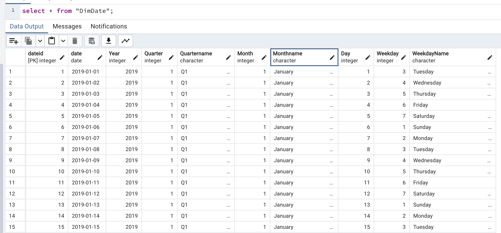
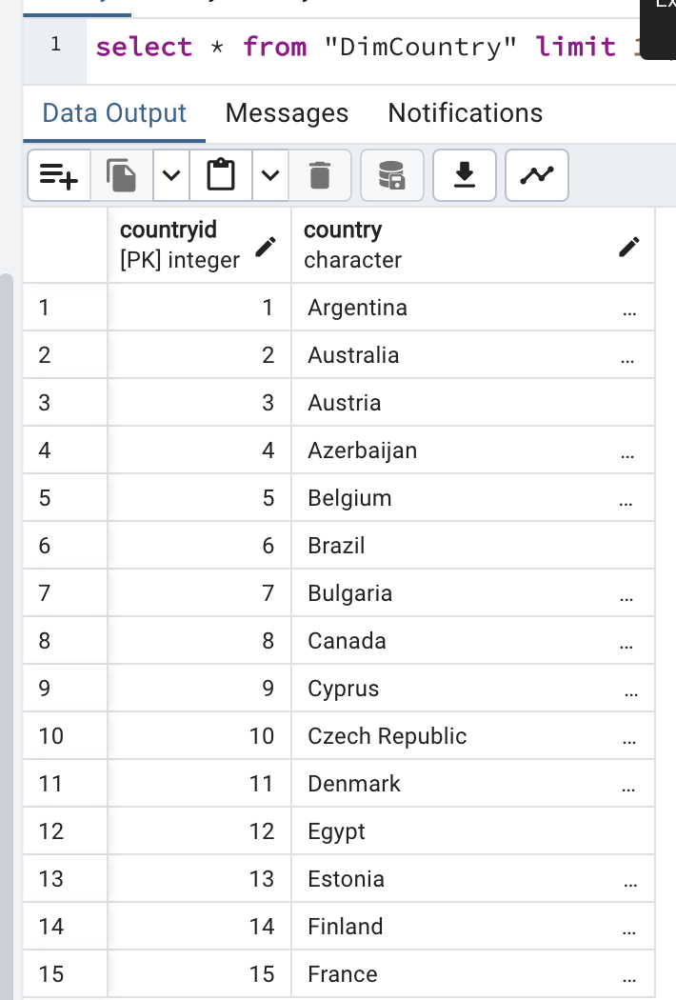
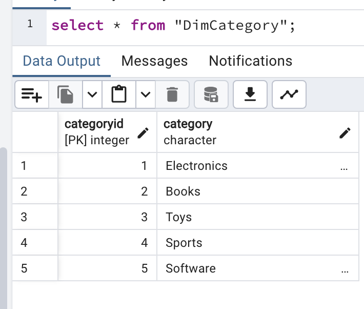
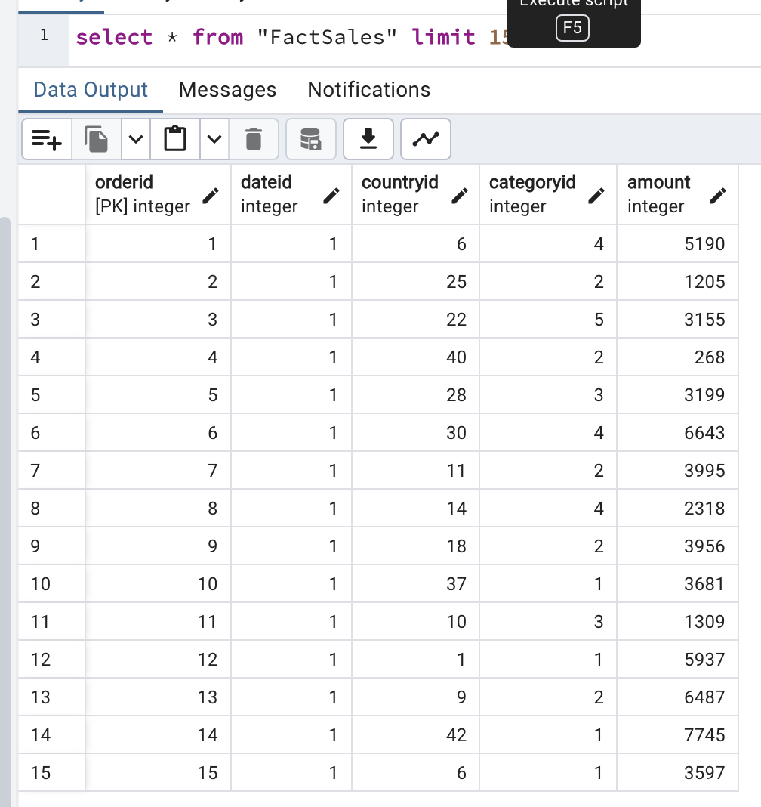

# Data warehouse Reporting

> Using the updated schema design, load the sample datasets into their respective tables. We will generate reports out of the data in the data warehouse.


## Objectives

In this assignment you will:

- Load data into Data Warehouse
- Write aggregation queries
- Create MQTs

## 1. Load data into Data Warehouse

Loading the data in the tables `DimDate`, `DimCountry`, `DimCategory`, and `FactSales`

- `DimDate`



- `DimCountry`



- DimCategory



- FactSales



## 2. Aggregation Queries

- The first Aggregation query will be `grouping sets` query using `category`, `country` and `totalsales`

	> `GROUPING SETS` is used to custom grouping combinations in a single query, offering the flexibility to specify exactly which sets of data should be aggregated together.


```sql

SELECT 
	dimcategory.category,
	country.country,
	sum(sales.amount) AS totalsales
FROM 
	"FactSales" AS sales
LEFT JOIN
	"DimCountry" AS country
	ON country.countryid = sales.countryid

LEFT JOIN  
	"DimCategory" AS dimcategory
	ON dimcategory.categoryid = sales.categoryid

GROUP BY
	GROUPING SETS(
		(dimcategory. category, country.country),
		(dimcategory.category),
		(country.country),
		()
	)
ORDER BY country.country, dimcategory.category DESC;

```
- We can see the first rows below and the full data here [`grouping_sets.csv`](grouping_sets.csv)

| category        | country       | totlasales  |
|-----------------|---------------|-------------|
|                 | Argentina     | 21755581    |
| Toys            | Argentina     | 4389307     |
| Sports          | Argentina     | 4450354     |
| Software        | Argentina     | 4292153     |
| Electronics     | Argentina     | 4338757     |
| Books           | Argentina     | 4285010     |
| 	              | Australia     | 21522004    |
| Toys            | Australia     | 4375613     |
| Sports          | Australia     | 4201103     |
| Software        | Australia     | 4410360     |
| Electronics     | Australia     | 4194740     |
| Books           | Australia     | 4340188     |


----


- The second aggregation query will be `rollup` query using columns `year` , `country` and `totalsales`

	>`ROLLUP` is used to produce aggregate summaries and subtotals, enabling hierarchical data analysis from the most detailed level up to a grand total.

```sql
SELECT 
	dimdate.year, 
	country.country,
	sum(sales.amount) AS totalsales
FROM 
	"FactSales" AS sales
LEFT JOIN
	"DimDate" AS dimdate
	on dimdate.dateid = sales.dateid
LEFT JOIN
	"DimCountry" AS country
	on country.countryid = sales.countryid
group by 
	ROLLUP (
		dimdate.year,
		country.country
	) 
ORDER BY  country.country,dimdate.year;
```

- We can see the first rows below and the full data here [`rollup.csv`](rollup.csv)

| year | country   | totalsales  |
|------|-----------|-------------|
| 2019 | Argentina | 7163167     |
| 2020 | Argentina | 7327655     |
| 2021 | Argentina | 7264759     |
| 2019 | Australia | 7259016     |
| 2020 | Australia | 6964260     |
| 2021 | Australia | 7298728     |
| 2019 | Austria   | 7320233     |
| 2020 | Austria   | 7071166     |
| 2021 | Austria   | 6974327     |

-----


- The third aggregation query will be `cube` query using the columns `year`, `country` and `average sales`

> The `CUBE` is used to generates a multidimensional aggregation, providing subtotals for all possible combinations of specified dimensions, including the overall grand total.

```sql 
SELECT 
	dimdate.year, 
	country.country,
	round(avg(sales.amount),2) AS avg_sales
FROM 
	"FactSales" AS sales
LEFT JOIN
	"DimDate" AS dimdate
	ON dimdate.dateid = sales.dateid
LEFT JOIN
	"DimCountry" AS country
	ON country.countryid = sales.countryid
GROUP BY 
	CUBE (
		dimdate.year,
		country.country
	) 
ORDER BY  country.country,dimdate.year;
```

- We can see the first rows below and the full data here [`cube.csv`](cube.csv)

| year | country   |  avg_sales |
|------|-----------|------------|
| 2019 | Argentina | 4017.48    |
| 2020 | Argentina | 4114.35    |
| 2021 | Argentina | 4102.07    |
|      | Argentina | 4077.90    |
| 2019 | Australia | 4066.68    |
| 2020 | Australia | 3899.36    |
| 2021 | Australia | 4091.22    |
|      | Australia | 4019.05    |

----

- Finally We create an `MQT` named `total_sales_per_country` that has the columns `country` and `total_sales`.

>An MQT, or Materialized Query Table, is a physical table in a database that stores the result of a query to enhance data retrieval speed and query performance.
 

```sql
CREATE MATERIALIZED VIEW total_sales_per_country AS
SELECT 
	country,
	SUM(amount) AS totalsales
FROM 
	"FactSales" AS sales 
JOIN 
	"DimCountry" AS country 
	ON country.countryid = sales.countryid 
GROUP BY 
	country.country;
```

We can see the first rows below and the full data here [`MQT.csv`](mqt.csv)

```sql
SELECT 
	* 
FROM 
	total_sales_per_country
ORDER BY 
	country
LIMIT 15;
```

| country          | totalsales  |
|------------------|-------------|
| Argentina        | 21755581    |
| Australia        | 21522004    |
| Austria          | 21365726    |
| Azerbaijan       | 21325766    |
| Belgium          | 21498249    |
| Brazil           | 21350771    |
| Bulgaria         | 21410716    |
| Canada           | 21575438    |
| Cyprus           | 21500526    |
|Czech Republic    | 21334142    |
|Denmark           | 21331097    |
|Egypt             | 21379967    |
|Estonia           | 21493054    |
|Finland           | 21336188    |
|France            | 21341055    |


